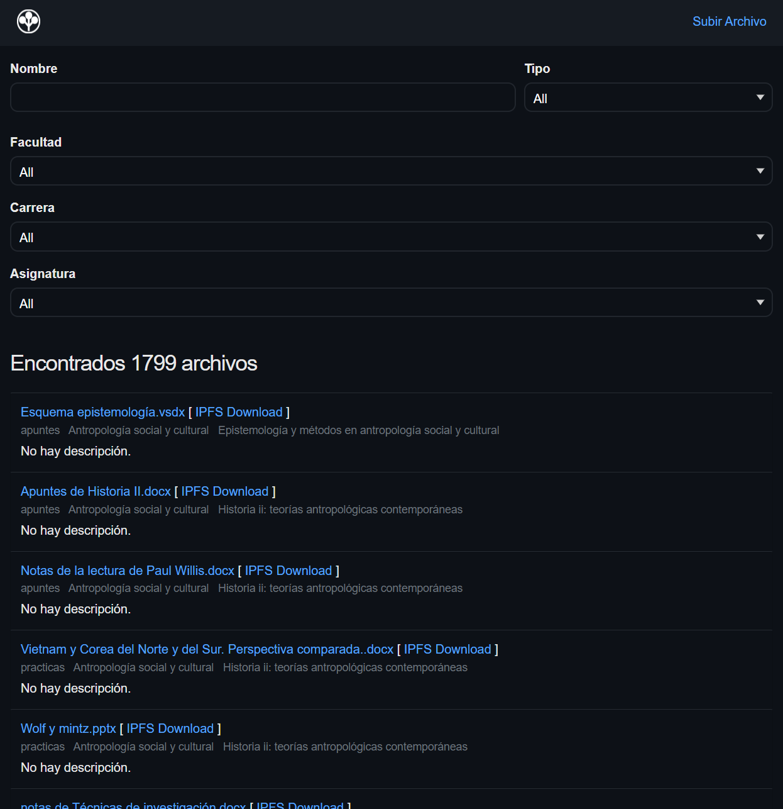
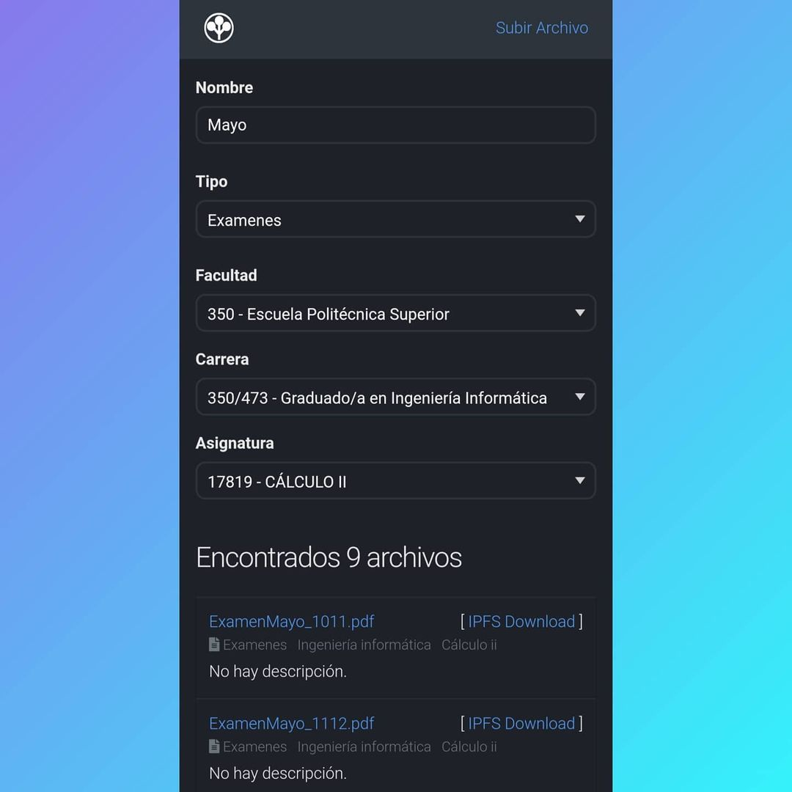

# Ecaf

This is a file sharing platform for universities. Uploaded files will get saved to disk and pinned to the IPFS network.

| Desktop Demo  | Mobile Demo   |
| ------------- | ------------- |
 | 

# Starting the server for development

Make sure you have a Postgres database running and erlang and elixir installed in the computer. If you want to use IPFS, you need to run a go-ipfs instance on the server.

To start your Phoenix server:

  * Install dependencies with `mix deps.get`
  * Create and migrate your database with `mix ecto.setup`
  * Install Node.js dependencies with `npm install` inside the `assets` directory
  * Start Phoenix endpoint with `mix phx.server`

Now you can visit [`localhost:4000`](http://localhost:4000) from your browser.

Ready to run in production? You can just use the `run_prod.sh` script (with the appropiate modifications).
